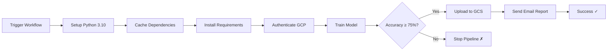

# MLOps Pipeline: Automated Model Training & Deployment

[](https://github.com/JayJajoo/GitLabsExps/actions)
[](https://www.python.org/)
[](https://cloud.google.com/)

An automated MLOps pipeline that trains a Random Forest classifier on the Iris dataset, validates model performance, stores models in Google Cloud Storage, and sends email reports—all triggered through GitHub Actions.

## 🚀 Features

- **Automated Training**: Train Random Forest models on the Iris dataset
- **Quality Gate**: 75% accuracy threshold prevents deployment of poor models
- **Cloud Storage**: Automatic model versioning and storage in GCS
- **Email Notifications**: Detailed classification reports sent via email
- **CI/CD Pipeline**: Fully automated workflow using GitHub Actions
- **Dependency Caching**: Optimized build times with pip cache

## 📋 Prerequisites

- Python 3.10+
- Google Cloud Platform account with a storage bucket
- Gmail account for sending email reports
- GitHub repository with Actions enabled

## 🔧 Setup

### 1. Clone the Repository

```bash
git clone https://github.com/JayJajoo/GitLabsExps.git
cd GitLabsExps
```

### 3. Configure Google Cloud Storage

1. Create a GCS bucket named `mlops_assignment_bucket_1` (or update the bucket name in `train_and_save_model.py`)
2. Create a service account with Storage Admin permissions
3. Download the service account JSON key

### 4. Set Up GitHub Secrets

Add the following secrets to your GitHub repository (`Settings > Secrets and variables > Actions`):

| Secret Name | Description |
|------------|-------------|
| `GCP_SA_KEY` | Your GCP service account JSON key (entire contents) |
| `EMAIL_USER` | Gmail address for sending reports |
| `EMAIL_PASS` | Gmail app password ([generate here](https://myaccount.google.com/apppasswords)) |

### 5. Update Email Recipient

Edit `train_and_save_model.py` and change the recipient email:

```python
recipient_email = "your_email@example.com"  # Line 89
```

## 🎯 Usage

### Manual Trigger via GitHub Actions

1. Go to the **Actions** tab in your GitHub repository
2. Select **"Train and save model to GCS"** workflow
3. Click **"Run workflow"**
4. Select the branch and click **"Run workflow"**

## 📁 Project Structure

```
GitLabsExps/
├── .github/
│   └── workflows/
│       └── train_and_save.yml    # GitHub Actions workflow
├── train_and_save_model.py       # Main training script
├── requirements.txt              # Python dependencies
├── .gitignore                    # Git ignore rules
└── README.md                     # This file
```

## 🔄 Workflow Pipeline



## 📊 Model Details

- **Algorithm**: Random Forest Classifier
- **Dataset**: Iris (150 samples, 4 features, 3 classes)
- **Train/Test Split**: 80/20
- **Hyperparameters**: 100 estimators, random_state=42
- **Accuracy Threshold**: 75% minimum for deployment

## 📧 Email Report Format

The automated email includes:
- Overall model accuracy
- Detailed classification report (precision, recall, F1-score per class)
- Timestamp and model location in GCS

## 🗂️ Model Versioning

Models are saved with timestamps in the following format:
```
gs://mlops_assignment_bucket_1/trained_models/model_YYYYMMDDHHMMSS.joblib
```

Example: `model_20250120143052.joblib`

## 🛠️ Technologies Used

- **Machine Learning**: scikit-learn
- **Cloud Storage**: Google Cloud Storage
- **CI/CD**: GitHub Actions
- **Email**: smtplib (Gmail SMTP)
- **Model Persistence**: joblib